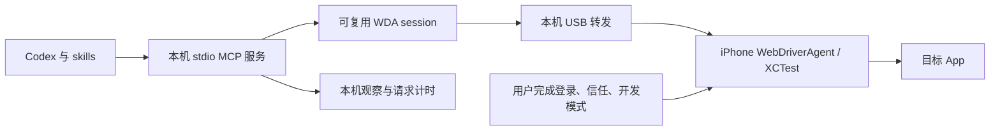

# 控制通道与完成证据

插件把本机安装、真机控制与业务验收分开：setup skill 引导用户完成 Apple 账户和手机确认；MCP 工具执行可重复操作；use skill 根据用户任务核对结果。目标是让普通操作直接成为工具调用，减少每步重写 Python / HTTP 代码和模型往返。

WDA 使用 XCUITest 在手机端读取控件与注入交互。相比镜像路径，手机内容无需经过 Mac 镜像窗口的 AX 树或桌面鼠标坐标。设备必须正确配对、具备开发签名与开发模式，Runner 测试进程需要保持运行；目标 App 的登录和保护画面仍有自己的条件。

## 工具职责

| 工具 | 负责的工作 | 关键完成证据 / 边界 |
| --- | --- | --- |
| `wda_doctor` | 探测设备、Xcode、签名 / 构建环境、连接状态 | 按实际缺项诊断，不把缺少工具当 App 不支持。 |
| `wda_setup` | discover / fetch / configure / build / start / stop / status | 构建、Runner 运行和 USB 转发分层检查；长操作 status 跟踪，不重复启动。 |
| `wda_ready` | WDA 状态、会话、真实前台、有效视口与当前观察验收 | 一次失效前台读取重试；持续通道故障可恢复已核验归属的服务。READY 表示通道可用，App 登录与业务结果独立验证。 |
| `wda_observe` | tree / screenshot / both，当前设备视口与观察 ID | 默认最多 100 个节点、过滤视口外节点、跳过昂贵 visible 属性；截断和无标签需截图。 |
| `wda_apps` | 已选设备安装列表、本地核验别名、Apple Search 元数据 | 返回来源 / 发布者 / 核验时间；商店存在不表示本机已安装，失败是明确工具错误。 |
| `wda_find` / `wda_wait` | 精确查询与有界等待目标 selector | 唯一目标与当前页面语义；通用标签不代表正确页面。 |
| `wda_tap` | selector 点击或引用新观察的设备点点击 | 视口与观察约束、可选 expect 与后续观察；HTTP 成功不是业务成功。 |
| `wda_swipe` | 当前区域短拖动，必要时原生 swipe | 默认验证、最多 2 次尝试；observe 只控制输出；无进展也返回已执行状态和所选新观察，不证明空列表 / 到底。 |
| `wda_type_text` | 对明确文本框输入并回读 | 默认无换行、无 submit；不一致 / 不可核验不能继续提交。 |
| `wda_press_button` / `wda_launch_app` | 支持的系统按钮与 App 启动 | Home 用专用 homescreen 并核验 SpringBoard；音量只表示执行；启动核对实际前台。 |
| `wda_batch` | 最多 20 步的已知短路径 | 顺序执行，failed / uncertain 停止；不能预测未知页面或盲批发送。 |
| `wda_scroll_find` | 最多 10 次 swipe 查找目标 | 返回找到 / 未找到及边界，不无限滚动。 |
| `wda_collect_list` | 默认 Cell / 6 页、最多 10 页的列表采集与去重 | complete 始终 false；end_selector 的可点击终点证据不代替条数 / 金额对账。 |
| `wda_metrics` | 请求、工具、动作 / 观察计时 | 分清 HTTP 与端到端成本，不替代交付验收。 |

这里只描述使用契约；实际可用参数以 MCP schema 为准。插件不暴露通用 raw HTTP、任意代码执行或绕过控制检查的工具。

输入对象保持封闭，未知字段在手机动作前拒绝，并附 `argument_path/unknown_fields/allowed_fields/action_executed=false`。selector 可组合 label/name/value/type/enabled；enabled 接受布尔值或树中的精确 true/false 字符串，rect/visible/in_viewport 是观察元数据。predicate 仍单独使用。精确文本由插件编码为 NSPredicate 字面量，换行等控制字符使用 Unicode 转义，保留引号、反斜线及实际字符串；不让模型删掉真实标签来规避编码错误。

## 观察与动作约束

观察由 WDA 的 source / screenshot 和设备 window size 形成；screenshot 模式跳过 source。返回坐标单位为设备点，截图像素可能具有不同缩放。坐标点击必须使用对应当前视口的 `observation_id`，30 秒过期，动作前再检查 App、页面 / 图像签名与视口变化。自选滚动区域使用 tree/both 的完整内部节点（不受返回截断影响），只比较中心位于区域内的控件及全页原生 Alert/Sheet，包括无标签浮层；区域外轮播不影响滚动。区域内异步刷新仍需新观察；截图单独模式不能提供区域语义锚点。切换 App、用户接管、重新连接或设备旋转后重新观察。

独立 `wda_observe` 使用 mode=tree/screenshot/both；动作输出使用 observe=none/tree/screenshot/both。swipe 默认 observe=tree，复用进展验证的树；none 省去返回观察，仍执行 verify=true 的内部检查。只有显式 verify=false 才省去滚动进展验证。`no_scroll_progress` 表示已接收有界手势、暴露的内容 / 几何未确认变化，携带执行和验证状态、所选新观察、尚未证明终点的恢复建议。实际页面可能仍是总览入口、边界、浮层或自绘列表，应据观察改变目标而非重复同一手势。

0.1.4 在手势前检查原生 Alert / Sheet：默认区域被拒绝，有意滚动浮层列表需新观察及完全处于所有当前浮层边界内的区域。每次手势后先核对视口及原生浮层变化，再判断内容进展；上下文变化时停止备用手势。verify=false 仍执行上下文检查，仅省去进展比较。自绘面板未必有原生模态节点，不能据此证明无浮层。自选区域失效返回原因、新 tree 观察，以及节点数 / 内容 / 几何变化诊断；坐标 tap 仍保持全页保护。

App 激活仅执行一次，之后最多 5 秒读取前台，匹配即继续。超时或读取失败保留已接受动作证据；等待不重放 activate，前台通过也不能代替目标页 / 登录 / 业务验收。

默认轻量树避免为每个节点计算昂贵属性，但无法保证元素真实可点击。固定表头、浮层、自绘和无标签控件需要截图验证。树中元素、`visible=true`、HTTP 200 和页面指纹变化分别只证明一个层次的事实，不能扩展为完整任务成功。

mutation 超时后可能已经作用于手机；先用只读新观察核对状态，不能自动重放可能产生重复写入的操作。控制器记录成功接收的 mutation；之后发生读取或后置条件错误时补充 action_executed=true、action_complete=false，即使 uncertain=false 也不能重放完整操作。多步工具保存边界并在失败 / 不确定处停下，由新证据决定是否继续。业务验收由用户目标决定，例如完整列表、准确字段、零误发送、正确收件位置或写后回读。

## 通道故障与服务恢复

`local.pid.0` / `wda_foreground_unavailable` 表示 WDA 无法解析真实前台，XCTest Code 41 表示测试动作未获授权；这些错误和 schema 校验分属不同层。`wda_observe`、find、wait 保持读取职责，不自动重启服务。READY 对失效前台只清理旧会话 / 观察并重读一次；读取成功即可恢复，持续失效前台或授权故障才在默认 recover=true 时尝试后台服务恢复。正常操作任务首次核验使用默认 true，recover=false 仅用于明确禁止重启或明确要求只读诊断的用户指令；不发起新重启，可以报告已有恢复工作。手机锁定、镜像冲突或其他未分类错误按各自原因处理。

恢复队列复用配置和有效构建，在停止前再次核验 worker 身份、owner token、配置指纹、endpoint、实际回环监听及进程组归属。只有唯一匹配的本插件服务可重启；外部服务、归属证据缺失、端口换成其他所有者或缺少构建时拒绝恢复。后台工作去重，同一配置近期恢复有 120 秒冷却，不暴露可任意杀进程或重放手机动作的工具。

0.1.4 起，READY 将预期的准备状态作为正常工具结果呈现：`ready=true, state="ready"` 才通过通道验收；`ready=false, state="recovering"` 带 recovery.job_id/status_arguments/下一次 READY 参数；关闭恢复后的持续通道故障返回 `ready=false, state="recovery_required", reason="recovery_disabled"`，附 cause 和允许恢复时的下一次调用。已有恢复工作优先返回 recovering，不把即将停止的旧服务验为 READY。两种未就绪结果没有 error，MCP isError=false 只表示状态探测正确完成。调用方必须继续按 ready/state 判断，不能据传输成功宣称通道或任务完成。工具的恢复建议不覆盖用户禁止重启或只读诊断的限制。

调用方查询同一 setup 工作，检查 jobs 中的 recovery_phase：stopping → starting → serving；serving 后重新验证真实 READY。Runner 长期运行，工作可能仍为 running，不能把 succeeded 当成唯一恢复终点。启动失败、拒绝恢复、冷却、锁屏及其他实际故障仍返回错误和具体步骤，手机确认由用户完成。服务恢复作废旧 session 和观察，失败业务动作不会自动重放。启动前故障的实证与呈现改进见 [READY 启动审计](ready-startup-audit.md)。

## 安装与运行数据

MCP 服务采用 Python 标准库的 stdio JSON-RPC 和持久 HTTP 客户端，不需要 Appium server；Node 工具只负责 USB 转发。源码与插件分发包只含通用代码、skills 和合成评测。用户设备 / 团队配置、WDA checkout、构建产物、Runner 及转发进程状态与截图默认位于 `~/.local/share/iphone-use-wda`，排除 Git。设备选择与签名不硬编码作者配置，本机端口默认 18100、设备端口 8100，USB 转发只绑定本机。

观察返回 `nodes/viewport/image.path/observation_id`，动作返回的观察嵌套于 `observation`。截图唯一命名，默认保留最近 100 张；XML 与完整动作轨迹不会自动持久保存。当前 MCP 进程的 metrics 最多保留 2000 条 HTTP、500 条工具记录，仅含时间 / endpoint / 错误等运行信息；重启后重置，不存文本与业务值。完整任务审计需要单独保留必要本机证据，不能只靠 metrics 还原手机业务状态。

Apple Account 登录、验证码、信任设备、开发模式重启确认与目标 App 认证由用户在系统界面完成。技能只在实际阻塞时提供准确步骤，不添加统一审批流。免费签名、证书和 provisioning 会过期；恢复策略依据当前日志，复用可用构建，仅在必要时重建。

## 验证层级

自动测试适合验证输入参数、selector 消歧、观察 ID / 视口检查、mutation 不盲重试、批次停止、去重与上限。真机预检适合验证当前设备上的截图、中文、短手势和 READY。完整业务评测再核对账户页面、日期、过滤、分页与副作用。这三个层级不能互相替代。

架构支持减少每步客户端启动、冗长 XML 和模型决策回合；真实端到端速度取决于 WDA、App、模型响应与任务验证。使用 metrics 对照耗时，同时保留完整度和副作用指标。与历史路径比较时注明启动方式和任务范围变化。

## 同机并发与占用

WDA 只有一个活动 session，新建会话会清除旧元素缓存。同一外部运行目录内的 MCP 进程共用 session.json 和非阻塞操作锁；一个操作正在执行时另一调用返回 device_busy，不发送手机动作。元素 ID 不跨重建会话重用。此机制只协调本插件同一运行目录，外部 WDA 客户端仍可能抢占；抢占后的失败必须先重新观察。

READY 额外检查手机解锁状态。真机实测发现，镜像占用可让 WDA 仍报告 ready=true / locked=false，但系统页树为空、截图是 Mac 占用锁屏；这种组合返回 mirroring_conflict，退出镜像后重验。无标签的自绘 UI 单独交给截图判断，不自动判为系统永久不可用。
