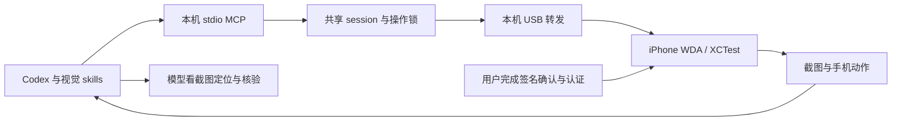

# 视觉控制与结果证据

本插件从 iphone-use-wda 0.1.4 复制，使用独立 manifest、MCP 服务名、工具前缀和 skills；安装 / 签名 / 构建 / 恢复与应用查询复用原实现。正常路径以任务效率为先：模型使用已经看过的截图直接操作，XML 仅用于更高效的页面数据读取。

0.1.2 安装时将安装目录中的同一 stdio 服务器通过 `codex mcp add` 注册为 `iphone_wda_vision`。显式配置优先于插件的同名 MCP 声明，避免 Codex AgentPlugin 共享工具说明预算裁剪工具；保留原工具名称，不产生新前缀或逐次 CLI 调用。插件仍提供两个 skills。安装脚本只更新本插件的 MCP 注册，所有手机状态和操作实现不变。

## 截图契约

observe 各读取一次 WDA /screenshot、设备点 viewport 和前台 App，共 3 次 GET。PNG 返回 image.path、width / height、pixel_to_point 与 observation_id。坐标转换为 `x_point = x_pixel × image.pixel_to_point.x`，y 同理；不使用 Mac 坐标或宿主缩略图尺寸。

前台 App 信息是可选提示，最多等待 2 秒；读取失败或返回 local.pid.* 时保留截图与坐标比例，不因此重建通道。

observation_id 是可选元数据，不绑定 Runtime / 进程，不设 30 秒过期，不计算整图哈希。手机动作直接执行给定参数，没有强制动作前截图、视口或前台复查。模型可以使用 READY、observe 或前一步动作返回且已经看过的截图；时钟、光标与轮播变化无需重新读取或等待。

手机动作默认 observe=true 读取后置截图。已知中间步骤可传 observe=false，最后读取结果即可；目标因页面切换、遮挡、旋转或用户接管而不明时，再截图定位。MCP 附图或代码入口的本机图片需要实际查看，JSON 路径本身不等于看过页面。

工具结果描述动作执行与读取结果。工具执行完成、HTTP 成功、前台匹配和画面变化都不自动证明用户任务完成；模型按截图核对目标页、内容和业务结果。

## 动作契约

| 工具 | 执行与证据 |
| --- | --- |
| tap / long_press | 按已经看过的截图确定设备点坐标；无 selector / expect。 |
| swipe | 按截图确定 direction / region，一次手势；模型从结果图判断进展。 |
| type_text | WDA 全局 keys 注入，text 为唯一必填字段；不自动选字段、清空、replace、submit 或 XML value 回读。 |
| launch_app | 已核实 bundle ID，activate 一次；不要求旧页面观察，不固定轮询前台。 |
| press_button | Home 用 homescreen，音量使用对应按键；不要求旧页面观察。 |
| wait | 确实需要加载时短暂等待并获取截图；不固定等待时钟窗口。 |
| batch | 最多 20 步、全部参数先校验；连续执行已知步骤，默认省略中间截图并返回最终截图。 |

每个手机动作的 observation_id 和 observe 均可选。focused_input_confirmed / multiline_confirmed 只作旧接口兼容，不设输入关卡；模型仍按画面选择输入目标。allow_newlines 默认 false，需要换行时显式开启，因为 Return 可能提交。发送依据用户授权、正确对象和已核对的草稿完成。

batch 可以组合已看见的输入框点击与输入，或已知的 Home 与 App 启动。不猜未知下一页的坐标；需要下一页判断时让前一步返回截图。失败或执行不确定即停，completed_steps / stopped_at 表示执行边界，后续只继续未完成范围。

## XML 页面读取

read_page(reason 可选, max_nodes=100) 在文字 / 列表读取更高效时执行。输出页面文字 / 值及截断信息，不返回操作目标几何。纯读取保留已获取的截图，不强制再 observe。

XML 不用于操作定位、输入焦点、滚动区域或操作结果核验。原插件的 find / scroll_find / collect_list / predicate / tree / both 不属于视觉插件的交互路径。

## 复用、恢复与错误

默认状态目录 ~/.local/share/iphone-use-wda 保存 config、固定 WDA checkout、签名构建、Runner / 转发工作、session.json 与 operation.lock。两插件可以共安装，同一手机由一个代理操作；device_busy 不发送动作，不换目录避锁。

READY 默认 recover=true，检查实际 status、解锁、session、视口和截图，前台信息仅作可选提示。健康配置与服务直接复用，READY 的截图直接用于下一步，不立即重复 observe。iPhone 镜像运行本身不构成拒绝条件，按实际设备状态判断。setup status 的 jobs 是数组；service.ready 或 recovery_phase=serving 表示服务可供重新验 READY，长期运行的 Runner 无需等 succeeded。

持续通道故障才恢复归属已核验的插件服务，保留有效构建、工作去重与恢复冷却。服务恢复不重放手机动作；超时或后置截图失败时先核对实际状态，避免重复输入、提交或整个 batch。

密码 / PIN / 验证码与生物识别由用户在手机完成。接管期间暂停该手机的动作、读取、XML 与截图，收到明确完成通知后新截图核对进度并继续剩余任务。

## 分发与验证

插件包保存通用代码、skills、文档、测试与合成评测。设备标识、签名、构建、日志、截图和 App 安装清单留在仓库外私有目录。

自动测试验证默认无 XML 路径、截图坐标、可选观察元数据、读取次数、批次执行、输入兼容与不重放。真机通道预检、实际手机操作和完整业务结果分别记录。验证见 [validation.md](validation.md)，场景规范见 [cases.json](../evals/cases.json)。metrics 统计工具和 HTTP 耗时，不代表完整任务耗时或业务准确度。
